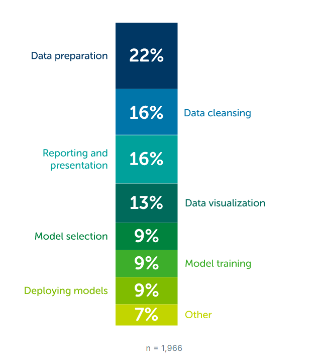

# Novedades respecto a la clase anterior

### Hoy en clase veremos:

[Skills](https://www.simplilearn.com/what-skills-do-i-need-to-become-a-data-scientist-article)

[+Skills](https://www.datacamp.com/blog/top-15-data-scientist-skills)

[++Skills](https://www.coursera.org/articles/data-scientist-skills?utm_medium=sem&utm_source=gg&utm_campaign=B2C_EMEA__coursera_FTCOF_career-academy_pmax-multiple-audiences-country-multi-set2&campaignid=20882109092&adgroupid=&device=c&keyword=&matchtype=&network=x&devicemodel=&adposition=&creativeid=&hide_mobile_promo=&gad_source=1)

[2022 State of Data Science](https://www.anaconda.com/resources/whitepapers/state-of-data-science-report-2022)

  * Semana de consolidar Data Analysis
  * SQL en AWS

