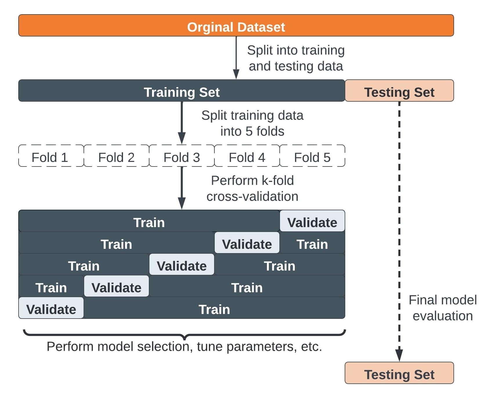

# Novedades respecto a la clase anterior

  

  Separar train y test ya que quieres "simular" como funcionará tu modelo con datos que nunca haya visto, nuevos, en el futuro. Guardas un test que simula ser estos datos nuevos de los que no sabes nada todavía

  *Train*: features (X_train, train) y target (train_label, train_target, train_y)

  *Test*: features (X_test, test) y target (test_label, test_target, test_y)

  *Hiperparámetros*: argumentos del modelo que no son los propios datos y va a determinar las (meta) características de tu modelo: profundidad del árbol, elementos mínimos en cada hoja. Sólo con los hiperparámetros de los modelos no podemos obtener ninguna métrica (accuracy, recall, precision, gini) porque se establecen ANTES de usar ningún dato. 

  *Ajuste del modelo (fit)*: usando los datos del Train (X_train, train) y la target (train_label, train_target, train_y) busca un modelo que, con las carácteristicas determinadas por los hiperparámetros (profundidad 2, mínimo 10 elementos en las hojas...) trata de minimizar el error o maximizar la métrica. 

  *¿Qué es minimizar el error o maximizar la métrica?* Existen infinitos modelos ¿cómo sabemos cuál es el mejor? Nosotros decimimos cuando un modelo es mejor: mayor R2, menor RMSE, mayor accuracy, menor gini, mayor recall, menor MAE... y el modelo trata de estimar unas predicciones usando los datos del train y las compara con la target y buscar maximizar (accuracy, recall...) o minimizar (RMSE, MAE, gini)

  Precisamente porque el modelo está preparado para usar los datos y ajustarse hacia maximinzar/minimizar corremos el riesgo de que sea un buen modelo para los datos del train, sobre los que calcula el ajuste, pero luego no va a ser tan bueno cuando aparezcan datos distintos.

  Para ello nos hemos guardado el test y su target: usamos el *predict* para hacer predicciones sobre el test, que son datos que nunca antes a visto, y por lo tanto no se ha podido ajustar/"memorizar" y vemos como lo hace en relación al valor real (target). 

  Si empeora mucho: quizá *overfitting* (cross validation, añadir más datos, modelo menos complejo, regularización...), si empeora muy poco: quizá *underfitting* (modelo más complejo, menos regulirazación). 

### Hoy en clase veremos:

* Para el bloque de Machine Learning el trabajo de clase será aplicar solo UNO de los modelos que vayamos viendo a un dataset
  * Sábado 6 julio de 2024
  * Podéis aprovechar el del EDA, si aplica
  * No lo dejéis para el final
  * Será formato presentación (80%) así que no os "calentéis" con el código

* Desde el lunes, dedicaremos un tiempo al comienzo de la clase a corregir ejemplos prácticos que opcionalmente podéis hacer en casa
  * El objetivo  es incentivar escribir código fuera de clase
  * Se colgarán al menos 2 días antes
  * Opcionales
  * Lunes: comparativa regresión lineal/árboles regresión  (está en 04-Ejercicios)
  * Miércoles: comparativa regresión logística/árboles clasificación

* Hoy en clase: 
  * Ensemble Learning
  * Interpretación de negocio
